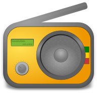

.. title:: Goodvibes - a lightweight radio player

.. toctree::
   :maxdepth: 1
   :hidden:
   :titlesonly:

   downloads
   user-guide
   screenshots
   changelog

**Goodvibes** is an internet radio player for GNU/Linux OS. It aims to be
light, simple, and to get its job done without any fuss.

Features
--------

The main interface is quite stripped-down, but there's a couple of additional
features waiting for those who dare to open the *Preferences* window !

 * **multimedia keys** support (ie. the ``<Play/Pause>``, ``<Previous>`` and
   ``<Next>`` keys that are present on most keyboards).
 * **notifications** (ie. information that pops up when the song change).
 * **do not suspend** (ie. prevent the system from suspending while a radio is
   playing).
 * **autoplay** (ie. start playing the last radio when you start the application).
 * **MPRIS2** support (ie. integration with modern desktops).

And for those of you who live mainly in a terminal and avoid graphical user
interfaces, you should know that you can build Goodvibes without GUI, and
control it via the command-line client provided.

Under the hood
--------------

Goodvibes is an open-source software, released under the
`GPLv3 <https://www.gnu.org/licenses/gpl-3.0.en.html>`_.

It's built using major open-source libraries, and it simply couldn't exist
without it. The core building blocks are provided by
`GLib <https://wiki.gnome.org/Projects/GLib>`_, the HTTP bits are handled by
`LibSoup <https://wiki.gnome.org/Projects/libsoup>`_, the audio part is left to
`GStreamer <https://gstreamer.freedesktop.org>`_, and the graphical user
interface is written with `GTK+ <https://www.gtk.org>`_.

Development takes place on `GitHub <https://github.com/elboulangero/goodvibes>`_,
and this is where you should head if you want to get in touch. El Boulangero
is the main author, and is the one writing these lines right now.

Translation happens on `Weblate <https://hosted.weblate.org/projects/goodvibes>`_.
If you want to contribute to the translation effort, don't be shy,
`get involved <https://hosted.weblate.org/engage/goodvibes>`_ !

Artwork is made by Hector Lahminèwskï. Feel free to visit his homepage
`Lahminewski Lab <http://lahminewski-lab.net>`_ and get in touch.
