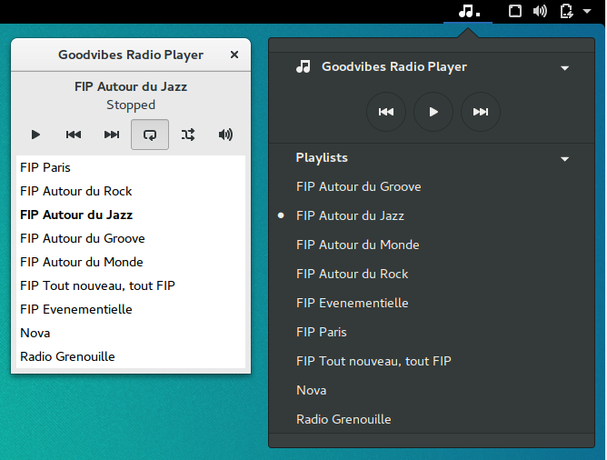
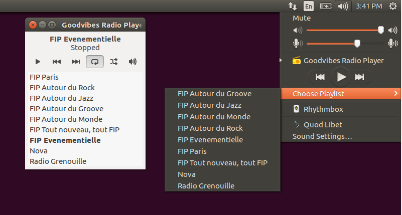
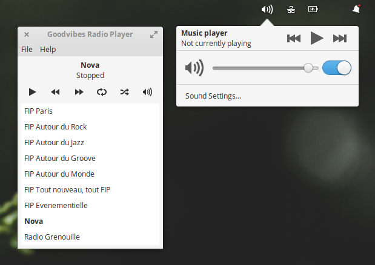
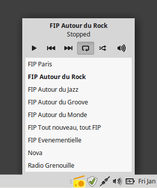
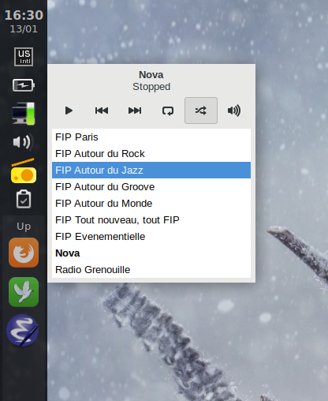

Screenshots
===========

Modern Desktops
---------------

Here are a few screenshots of Goodvibes with different desktop environments.

Nowadays, desktop environments usually provide a media player applet,
integrated somewhere in the desktop user interface. This applet provides basic
control over media players that implement the `MPRIS2
<https://specifications.freedesktop.org/mpris-spec/latest/>`_ specification.

These screenshots show both Goodvibes and the media player applet from
different desktop environments.

   **GNOME** (Ubuntu 16.04 LTS) with the *Media Player Indicator* extension

   **Unity** (Ubuntu 16.04 LTS)

   **Pantheon** (Elementary OS 0.4)

Old-style Desktops
------------------

It's possible to launch Goodvibes with the ``--status-icon`` option. In this
mode, Goodvibes will not display a main window, but will instead add an icon
to your notification area (also called system tray).

This is a kind of legacy feature, and it will be removed from Goodvibes at some
point in the future. This is not supported by the toolkit (GTK+) anymore, and
this is also disappearing from desktop environments (GNOME and Ubuntu at least).

Anyway, here's how Goodvibes looks like in *Status Icon* mode.

  **MATE** (Linux Mint 18.1)

   **Openbox/Tint2** (Debian Stretch)
