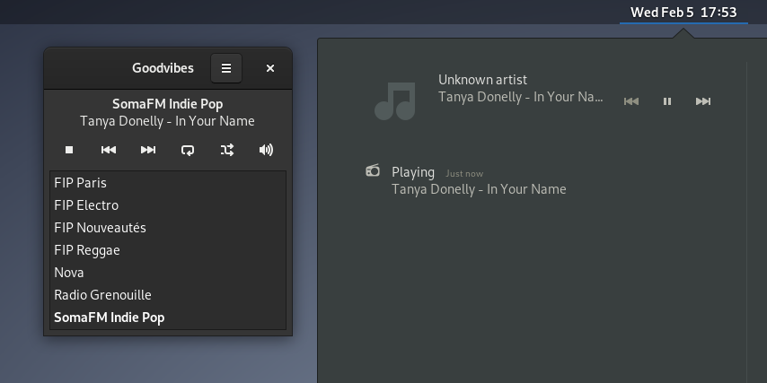
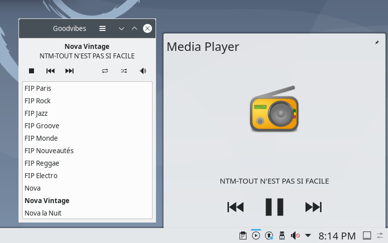
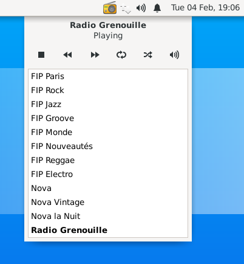

Screenshots
===========

Some basic screenshots to start with:

.. figure:: images/screenshot-ubuntu-19.10-01.png
   :align: center

   Dark theme (Ubuntu 19.10)

.. figure:: images/screenshot-ubuntu-19.10-02.png
   :align: center

   Dark theme, with the Preferences window opened (Ubuntu 19.10)

These days, "modern" desktop environments (say GNOME, KDE, Ubuntu at least)
are able to communicate with `MPRIS2
<https://specifications.freedesktop.org/mpris-spec/latest/>`_ capable media
players. It means that they can display information about what's playing, and
also allow some basic control over the player.

Here are some screenshots off such desktop integration:

   Dark theme, with the notification area opened (GNOME 3.30)

   Light theme, with the media player area opened (KDE 5.16)

It's also possible to launch Goodvibes with the ``--status-icon`` option. In
this mode, Goodvibes will not display a main window, but will instead add an
icon to your notification area (also called system tray).

This is a legacy feature. It doesn't work on some desktops. It's deprecated in
GTK3, and will be removed in GTK4. And at this point, it will also be removed
from Goodvibes.

This being said, here's how Goodvibes looks like in *Status Icon* mode.

   Light theme, in status icon mode (XFCE 4.14)
